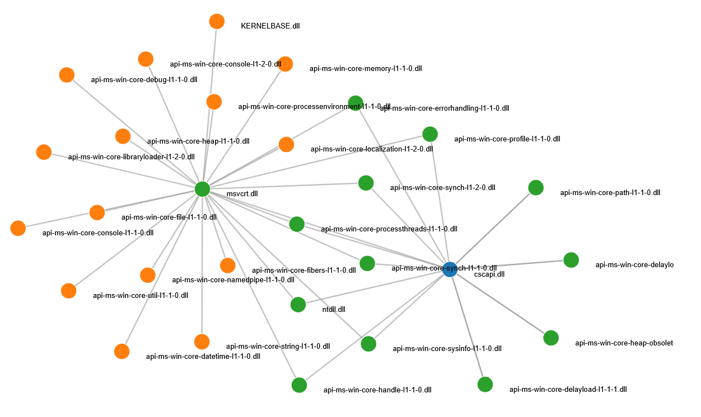

# 🔍 DLL Seeker

[](https://www.python.org/)
[](https://github.com/psf/black)

A comprehensive, professional-grade DLL analysis tool for Windows that extracts maximum information from Portable Executable (PE) files. DLL Seeker provides deep insights into DLL structure, dependencies, security indicators, and more.



## ✨ Features

### Core Analysis
- **PE File Parsing**: Complete analysis of PE headers, sections, and directories
- **Export/Import Analysis**: Detailed examination of exported and imported functions
- **Dependency Mapping**: Recursive dependency analysis with visual graphs
- **String Extraction**: Intelligent string categorization (URLs, IPs, registry keys, etc.)
- **Version Information**: Extraction of file version, product info, and metadata

### Security Analysis
- **Malware Detection**: Heuristic-based malware detection with risk scoring
- **YARA Integration**: Optional YARA rule scanning for pattern matching
- **Certificate Analysis**: Digital signature and certificate verification
- **Entropy Analysis**: Detection of packed/encrypted sections
- **Anti-Debug Detection**: Identification of anti-debugging techniques

### Advanced Features
- **DLL Comparison**: Side-by-side comparison of two DLLs
- **Performance Profiling**: Execution time measurement for each analysis step
- **Relocation Analysis**: ASLR compatibility and relocation information
- **Debug Information**: PDB path extraction and debug directory analysis
- **TLS Callbacks**: Detection of Thread Local Storage callbacks
- **Exception Handlers**: Structured Exception Handling (SEH) analysis

### Export Formats
- **JSON**: Structured data export
- **CSV**: Tabular data export
- **Markdown**: Human-readable documentation
- **XML**: Structured XML format
- **YAML**: Configuration-friendly format
- **SQL**: Database-ready INSERT statements
- **HTML**: Interactive dependency graphs

### Visualizations
- **Dependency Graphs**: Interactive HTML graphs (D3.js) and Graphviz DOT format
- **Rich Console Output**: Beautiful terminal output with tables, trees, and progress bars
- **Color-Coded Results**: Visual indicators for different analysis results

## 🚀 Installation

### Prerequisites
- Python 3.8 or higher
- Windows OS (for analyzing Windows DLLs)

### Quick Install

```bash
# Clone the repository
git clone https://github.com/LunaLynx12/Dll-Seaker.git
cd Dll-Seaker

# Create virtual environment (recommended)
python -m venv venv
venv\Scripts\activate  # On Windows
# source venv/bin/activate  # On Linux/Mac

# Install dependencies
pip install -r requirements.txt
```

### Optional Dependencies

For YARA scanning:
```bash
pip install yara-python
```

For Graphviz visualization:
```bash
# Install Graphviz system package first, then:
pip install pydot
```

## 📖 Usage

### Basic Analysis

```bash
# Analyze a DLL file
python dll_seeker.py path\to\file.dll

# Analyze with all features
python dll_seeker.py file.dll --malware --categorize-strings
```

### Export Options

```bash
# Export to JSON
python dll_seeker.py file.dll --json output.json

# Export to CSV
python dll_seeker.py file.dll --csv output.csv

# Export to Markdown
python dll_seeker.py file.dll --markdown output.md

# Export to XML
python dll_seeker.py file.dll --xml output.xml

# Export to YAML
python dll_seeker.py file.dll --yaml output.yaml

# Export to SQL
python dll_seeker.py file.dll --sql output.sql
```

### Advanced Features

```bash
# Malware detection
python dll_seeker.py file.dll --malware

# String categorization
python dll_seeker.py file.dll --categorize-strings

# Compare two DLLs
python dll_seeker.py file1.dll --compare file2.dll

# Generate dependency graph
python dll_seeker.py file.dll --graph html
python dll_seeker.py file.dll --graph dot

# YARA scanning
python dll_seeker.py file.dll --yara rules.yar

# Performance profiling
python dll_seeker.py file.dll --profile

# Use configuration file
python dll_seeker.py file.dll --config config.yaml
```

### Command-Line Options

```
positional arguments:
  dll_path              Path to the DLL file to analyze

optional arguments:
  -h, --help            Show help message
  --json [OUTPUT]       Export to JSON format
  --csv [OUTPUT]        Export to CSV format
  --markdown [OUTPUT]   Export to Markdown format
  --xml [OUTPUT]        Export to XML format
  --yaml [OUTPUT]       Export to YAML format
  --sql [OUTPUT]        Export to SQL format
  --malware             Perform malware detection analysis
  --categorize-strings  Categorize extracted strings
  --compare OTHER_DLL   Compare with another DLL
  --yara RULES_FILE     Scan with YARA rules
  --profile             Enable performance profiling
  --graph {dot,html}    Generate dependency graph
  --config CONFIG_FILE  Use configuration file
  --log-level LEVEL     Set logging level (DEBUG, INFO, WARNING, ERROR)
  --log-file FILE       Log to file
  --quiet               Suppress console output
  --no-cache            Disable result caching
```

## 📁 Project Structure

```
dll-seeker/
├── dll_seeker.py          # Main analysis tool
├── constants.py           # Constants and configuration
├── string_analyzer.py     # String categorization module
├── malware_detector.py    # Malware detection module
├── dll_comparator.py      # DLL comparison module
├── graph_generator.py     # Visual graph generation
├── performance_profiler.py # Performance profiling
├── relocation_analyzer.py # Relocations analysis
├── debug_extractor.py     # Debug information extraction
├── certificate_analyzer.py # Certificate analysis
├── yara_scanner.py        # YARA integration (optional)
├── config_manager.py     # Configuration management
├── export_formats.py     # Export format handlers
├── requirements.txt      # Python dependencies
├── README.md             # This file
└── .gitignore           # Git ignore rules
```

## 🔧 Configuration

Create a `config.yaml` file to customize analysis settings:

```yaml
analysis:
  enable_cache: true
  max_dependency_depth: 3
  min_string_length: 4

malware_detection:
  entropy_threshold: 7.0
  suspicious_imports:
    - "VirtualAlloc"
    - "VirtualProtect"
    - "WriteProcessMemory"

export:
  default_format: "json"
  include_hex_dumps: false
```

## 📊 Example Output

### Analysis Summary
```
╔═══════════════════════════════════════════════════════════╗
║                    DLL Analysis Summary                    ║
╠═══════════════════════════════════════════════════════════╣
║ File:          example.dll                                ║
║ Size:          245,760 bytes                              ║
║ MD5:           a1b2c3d4e5f6...                           ║
║ SHA256:        abc123def456...                            ║
║ Exports:       15 functions                               ║
║ Imports:       8 DLLs, 45 functions                      ║
║ Sections:      6 sections                                 ║
║ Risk Level:   LOW (Score: 20/100)                        ║
╚═══════════════════════════════════════════════════════════╝
```

### Dependency Graph
The tool can generate interactive HTML graphs showing DLL dependencies:


## 🛠️ Development

### Running Tests

```bash
# Run basic analysis test
python dll_seeker.py test.dll

# Test with verbose logging
python dll_seeker.py test.dll --log-level DEBUG
```

## 📚 Documentation

For detailed documentation, see the inline code comments and docstrings in each module.

### Key Modules

- **DLLSeeker**: Main analysis class with all core functionality
- **StringAnalyzer**: Categorizes strings into URLs, IPs, registry keys, etc.
- **MalwareDetector**: Applies heuristics for malware detection
- **GraphGenerator**: Creates visual dependency graphs
- **ExportFormats**: Handles various export formats

## 📧 Contact

For questions, issues, or suggestions, please open an issue on GitHub.


